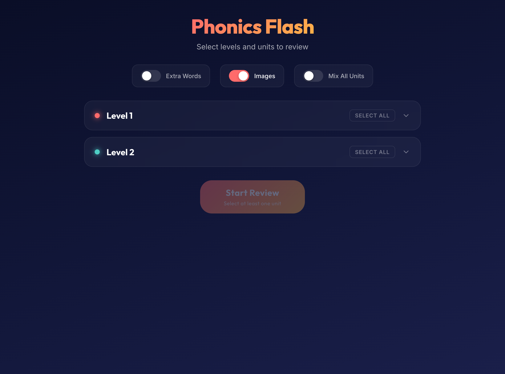

# ⚡ Phonics Flash

Phonics Flash is a modern, interactive web application designed for ESL (English as a Second Language) students and teachers. Built on top of **reveal.js**, it generates dynamic phonics review decks from a rich curriculum database. Whether reviewing individual units or blending multiple topics, Phonics Flash provides a structured, responsive, and visually engaging learning experience.



---

## ✨ Key Features

*   **Dynamic Curriculum Selection:** Pick and choose from 5 levels of phonics content, ranging from basic single letters (Level 1) to complex sounds and short vowels.
*   **Dual Review Modes:**
    *   **Normal Stack Mode:** Explores units in sequence. Navigate horizontally to switch units, and vertically to reveal the words within that unit. Toggle the **Sync** feature to lock your position across units.
    *   **All-in-One Deck (Mix Mode):** Shuffles and interleaves words across all selected units using a smart round-robin algorithm. This ensures variety and prevents back-to-back same-unit words.
*   **Three-Tier Audio fallback Engine:**
    1.  **Local MP3s:** Plays high-quality studio audio files mapped in the database if available.
    2.  **ElevenLabs TTS:** Generates high-fidelity natural speech using ElevenLabs API (with automatic caching for instant replay, a pool of random voices, and optimized ESL pronunciation speed).
    3.  **Web Speech API:** Seamlessly falls back to the browser's built-in speech synthesis if no network connection or ElevenLabs key is available.
*   **Bookmarkable & Shareable Decks:** Select your units and options, and the URL parameters update automatically. Save or share the URL to launch directly into a customized slideshow.
*   **Responsive & Polished UI:** Smooth theme switcher (Dark and Light modes) with responsive grid layouts, custom accordion menus, micro-animations, and full touch-gesture support.

---

## 🛠️ Tech Stack & Libraries

*   **Core Structure & Logic:** HTML5, Vanilla CSS3 (custom CSS variables, CSS grid/flexbox, transitions), and Vanilla ES6+ Javascript.
*   **Slideshow Framework:** [reveal.js](https://revealjs.com/) (loaded via CDN).
*   **TTS Integration:** ElevenLabs Text-to-Speech API.

---

## 🚀 Getting Started

Since Phonics Flash is a static web application, it does not require a complex build process.

### 1. Run Locally
Simply open `index.html` directly in your browser. For the best experience (and to prevent local file path or CORS warnings in some browsers), serve it via a local web server:

**Using Python:**
```bash
python3 -m http.server 8000
```
Then visit `http://localhost:8000`.

**Using Node.js:**
```bash
npx serve .
```

---

### 2. Configure ElevenLabs Text-to-Speech (Optional)

To enable natural, studio-quality AI voices instead of the browser's default TTS, create a configuration file at `js/config.js`. 

*(Note: `js/config.js` is included in `.gitignore` to protect your API credentials).*

#### `js/config.js` Template:
```javascript
const ELEVENLABS_CONFIG = {
  apiKey: 'YOUR_ELEVENLABS_API_KEY_HERE',
  modelId: 'eleven_flash_v2',
  voices: [
    {
      name: "Jessica",
      voice_id: "cgSgspJ2msm6clMCkdW9",
      gender: "FEMALE",
    },
    {
      name: "Brian",
      voice_id: "nPczCjzI2devNBz1zQrb",
      gender: "MALE",
    }
    // Add additional ElevenLabs voice profiles here
  ]
};
```

---

## 📂 Project Structure

```
Phonics Flash/
├── index.html          # Core layout, menu, and slideshow screens
├── css/
│   └── style.css       # Complete layout styling, custom themes & transitions
├── js/
│   ├── app.js          # Core app controller, menu building, state, & URL parameters
│   ├── audio.js        # Three-tier fallback audio engine & cache controller
│   └── config.js       # ElevenLabs API settings (gitignored)
├── data/
│   └── words.json      # Structured dictionary (levels, units, words, and media paths)
├── media/              # Local image and MP3 speech assets
└── screenshots/        # Visual documentation images
```

---

## ⌨️ Keyboard & Navigation Shortcuts

### Main Menu Screen
| Control | Action |
| :--- | :--- |
| **Enter** | Start review with selected units |

### Review Slideshow
| Control | Action |
| :--- | :--- |
| **Space** or **Enter** | Replay current word audio (or reveal word in Dictation/Quiz mode) |
| **Arrow Right / Left** | Next / Previous unit (Normal Mode) or Next / Previous slide (Mix Mode) |
| **Arrow Down / Up** | Next / Previous word within the unit (Normal Mode) |
| **Escape (Esc)** or **Backspace** | Exit slideshow and return to main menu |
| **Left Click (Word)** | Replay word audio |
| **Left Click (Background)** | Advance to the next slide |
| **Swipe gestures** | Navigation on tablets and smartphones |

### Word & Letter Chart
| Control | Action |
| :--- | :--- |
| **Type letters (e.g. `be`, `bed`)** | Multi-letter type-ahead search jumps directly to matching word |
| **Type same letter (e.g. `b`, `b`)** | Cycle through all words starting with that letter |
| **Arrow Keys** | 2D Grid navigation |
| **Space** or **Enter** | Replay current letter/word audio |
| **Backspace** | Remove last typed search letter (or exit to menu if buffer is empty) |
| **Escape (Esc)** | Exit chart and return to main menu |
| **Click / Tap Tile** | Select tile and play audio |

